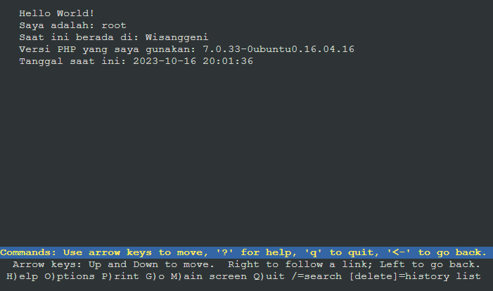
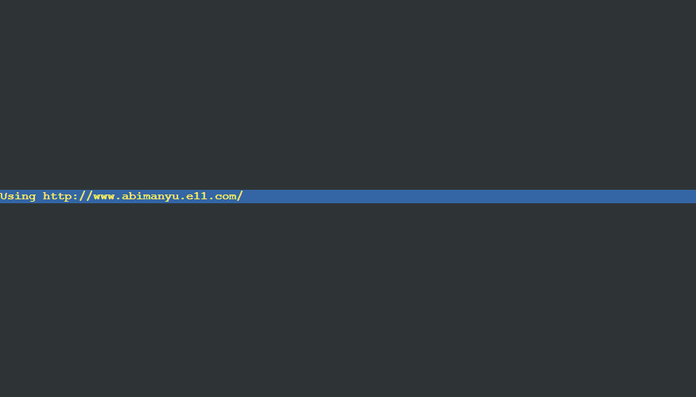

# Jarkom-Modul-2-E11-2023

Laporan resmi praktikum Jaringan Komputer modul 2 kelompok E11

| Nama                       | NRP        |
| -------------------------- | ---------- |
| Sarah Nurhasna Khairunnisa | 5025211105 |
| Tsabita Putri Ramadhany    | 5025211130 |

# Daftar Isi

- [SOAL](#soal)
- [JAWABAN](#jawaban)
  - [NO 1](#no-1)
  - [NO 2](#no-2)
  - [NO 3](#no-3)
  - [NO 4](#no-4)
  - [NO 5](#no-5)
  - [NO 6](#no-6)
  - [NO 7](#no-7)
  - [NO 8](#no-8)
  - [NO 9](#no-9)
  - [NO 10](#no-10)
  - [NO 11](#no-11)
  - [NO 12](#no-12)
  - [NO 13](#no-13)
  - [NO 14](#no-14)
  - [NO 15](#no-15)
  - [NO 16](#no-16)
  - [NO 17](#no-17)
  - [NO 18](#no-18)
  - [NO 19](#no-19)
  - [NO 20](#no-20)
- [KENDALA](#kendala)

# Soal

1. Yudhistira akan digunakan sebagai DNS Master, Werkudara sebagai DNS Slave, Arjuna merupakan Load Balancer yang terdiri dari beberapa Web Server yaitu Prabakusuma, Abimanyu, dan Wisanggeni. Buatlah topologi dengan pembagian sebagai berikut. Folder topologi dapat diakses pada drive berikut
2. Buatlah website utama pada node arjuna dengan akses ke arjuna.yyy.com dengan alias www.arjuna.yyy.com dengan yyy merupakan kode kelompok.
3. Dengan cara yang sama seperti soal nomor 2, buatlah website utama dengan akses ke abimanyu.yyy.com dan alias www.abimanyu.yyy.com.
4. Kemudian, karena terdapat beberapa web yang harus di-deploy, buatlah subdomain parikesit.abimanyu.yyy.com yang diatur DNS-nya di Yudhistira dan mengarah ke Abimanyu.
5. Buat juga reverse domain untuk domain utama. (Abimanyu saja yang direverse)
6. Agar dapat tetap dihubungi ketika DNS Server Yudhistira bermasalah, buat juga Werkudara sebagai DNS Slave untuk domain utama.
7. Seperti yang kita tahu karena banyak sekali informasi yang harus diterima, buatlah subdomain khusus untuk perang yaitu baratayuda.abimanyu.yyy.com dengan alias www.baratayuda.abimanyu.yyy.com yang didelegasikan dari Yudhistira ke Werkudara dengan IP menuju ke Abimanyu dalam folder Baratayuda.
8. Untuk informasi yang lebih spesifik mengenai Ranjapan Baratayuda, buatlah subdomain melalui Werkudara dengan akses rjp.baratayuda.abimanyu.yyy.com dengan alias www.rjp.baratayuda.abimanyu.yyy.com yang mengarah ke Abimanyu.
9. Arjuna merupakan suatu Load Balancer Nginx dengan tiga worker (yang juga menggunakan nginx sebagai webserver) yaitu Prabakusuma, Abimanyu, dan Wisanggeni. Lakukan deployment pada masing-masing worker.
10. Kemudian gunakan algoritma Round Robin untuk Load Balancer pada Arjuna. Gunakan server_name pada soal nomor 1. Untuk melakukan pengecekan akses alamat web tersebut kemudian pastikan worker yang digunakan untuk menangani permintaan akan berganti ganti secara acak. Untuk webserver di masing-masing worker wajib berjalan di port 8001-8003. Contoh
    - Prabakusuma:8001
    - Abimanyu:8002
    - Wisanggeni:8003
11. Selain menggunakan Nginx, lakukan konfigurasi Apache Web Server pada worker Abimanyu dengan web server www.abimanyu.yyy.com. Pertama dibutuhkan web server dengan DocumentRoot pada /var/www/abimanyu.yyy
12. Setelah itu ubahlah agar url www.abimanyu.yyy.com/index.php/home menjadi www.abimanyu.yyy.com/home.
13. Selain itu, pada subdomain www.parikesit.abimanyu.yyy.com, DocumentRoot disimpan pada /var/www/parikesit.abimanyu.yyy
14. Pada subdomain tersebut folder /public hanya dapat melakukan directory listing sedangkan pada folder /secret tidak dapat diakses (403 Forbidden).
15. Buatlah kustomisasi halaman error pada folder /error untuk mengganti error kode pada Apache. Error kode yang perlu diganti adalah 404 Not Found dan 403 Forbidden.
16. Buatlah suatu konfigurasi virtual host agar file asset www.parikesit.abimanyu.yyy.com/public/js menjadi
    www.parikesit.abimanyu.yyy.com/js
17. Agar aman, buatlah konfigurasi agar www.rjp.baratayuda.abimanyu.yyy.com hanya dapat diakses melalui port 14000 dan 14400.
18. Untuk mengaksesnya buatlah autentikasi username berupa “Wayang” dan password “baratayudayyy” dengan yyy merupakan kode kelompok. Letakkan DocumentRoot pada /var/www/rjp.baratayuda.abimanyu.yyy.
19. Buatlah agar setiap kali mengakses IP dari Abimanyu akan secara otomatis dialihkan ke www.abimanyu.yyy.com (alias)
20. Karena website www.parikesit.abimanyu.yyy.com semakin banyak pengunjung dan banyak gambar gambar random, maka ubahlah request gambar yang memiliki substring “abimanyu” akan diarahkan menuju abimanyu.png.

# Jawaban

## NO 1

Membuat topologi 5


- Buat projek baru pada GNS3
- Drag node NAT1 ke halaman
- Drag node ubuntu-1 ke halaman
- Ganti nama dan simbol ubuntu-1 menjadi router "Pandudewanata"
- Drag 3 node switch ke halaman
- Drag 8 node ubuntu-1 ke halaman
- Gantu nama dan simbol ubuntu-1 menjadi "Nakula", "Sadewa", "Yudhistira", "Werkudara", "Prabukusuma", "Abimanyu", "Wisanggeni", dan "Arjuna"
- Link setiap node sesuai dengan ketentuan topologi 5
- Setting network masing-masing node sesuai dengan prefix kelompok (10.42)

  - Pandudewanata

    ```bash
    auto eth0
    iface eth0 inet dhcp

    auto eth1
    iface eth1 inet static
        address 10.42.1.1
        netmask 255.255.255.0

    auto eth2
    iface eth2 inet static
        address 10.42.2.1
        netmask 255.255.255.0

    auto eth3
    iface eth3 inet static
        address 10.42.3.1
        netmask 255.255.255.0
    ```

  - Nakula
    ```bash
    auto eth0
    iface eth0 inet static
        address 10.42.1.2
        netmask 255.255.255.0
        gateway 10.42.1.1
    ```
  - Sadewa
    ```bash
    auto eth0
    iface eth0 inet static
        address 10.42.1.3
        netmask 255.255.255.0
        gateway 10.42.1.1
    ```
  - Yudhistira
    ```bash
    auto eth0
    iface eth0 inet static
        address 10.42.2.2
        netmask 255.255.255.0
        gateway 10.42.2.1
    ```
  - Werkudara
    ```bash
    auto eth0
    iface eth0 inet static
        address 10.42.2.3
        netmask 255.255.255.0
        gateway 10.42.2.1
    ```
  - Prabukusuma
    ```bash
    auto eth0
    iface eth0 inet static
        address 10.42.3.2
        netmask 255.255.255.0
        gateway 10.42.3.1
    ```
  - Abimanyu
    ```bash
    auto eth0
    iface eth0 inet static
        address 10.42.3.3
        netmask 255.255.255.0
        gateway 10.42.3.1
    ```
  - Wisanggeni
    ```bash
    auto eth0
    iface eth0 inet static
        address 10.42.3.4
        netmask 255.255.255.0
        gateway 10.42.3.1
    ```
  - Arjuna
    ```bash
    auto eth0
    iface eth0 inet static
        address 10.42.3.5
        netmask 255.255.255.0
        gateway 10.42.3.1
    ```

- Configurasi masing-masing node --> `nano /root/.bashrc`

  - PANDUDEWANATA
    ```bash
    iptables -t nat -A POSTROUTING -o eth0 -j MASQUERADE -s 10.42.0.0/16
    echo nameserver 192.168.122.1 > /etc/resolv.conf
    ```
  - YUDHISTIRA:
    ```bash
    echo nameserver 192.168.122.1 > /etc/resolv.conf
    apt-get update
    apt-get install bind9 -y
    apt-get install dnsutils -y
    apt-get install apache2 -y
    ```
  - WERKUDARA:
    ```bash
    echo nameserver 192.168.122.1 > /etc/resolv.conf
    apt-get update
    apt-get install bind9 -y
    apt-get install dnsutils -y
    ```
  - NAKULA:
    ```bash
    echo nameserver 192.168.122.1 > /etc/resolv.conf
    apt-get update
    apt-get install dnsutils -y
    apt-get install lynx -y
    ```
  - SADEWA:
    ```bash
    echo nameserver 192.168.122.1 > /etc/resolv.conf
    apt-get update
    apt-get install dnsutils -y
    apt-get install lynx -y
    ```
  - ARJUNA:

    ```bash
    echo nameserver 192.168.122.1 > /etc/resolv.conf
    apt-get update
    apt-get install nginx -y
    ```

  - ABIMANYU:
    ```bash
    echo nameserver 192.168.122.1 > /etc/resolv.conf
    apt-get update
    apt-get install nginx -y
    apt-get install php php-fpm -y
    apt-get install wget -y
    apt-get install unzip -y
    apt-get install apache2 -y
    apt-get install libapache2-mod-php7.0 -y
    ```
  - PRABUKUSUMA & WISANGGENI:
    ```bash
    echo nameserver 192.168.122.1 > /etc/resolv.conf
    apt-get update
    apt-get install nginx -y
    apt-get install php php-fpm -y
    apt-get install wget -y
    apt-get install unzip -y
    ```

- TESTING
  ```bash
  ping google.com
  ```
  
  

## NO 2

- YUDHISTIRA
  - Install BIND9
    ```bash
    apt-get update
    apt-get install bind9 -y
    ```
  - Menambahkan konfigurasi untuk zona `arjuna.e11.com` ke dalam file
    ```bash
    nano /etc/bind/named.conf.local
    ```
    ```bash
    zone "arjuna.e11.com" {
        type master;
        file "/etc/bind/jarkom/arjuna.e11.com";
    };
    ```
  - Membuat directory baru untuk menyimpan file konfigurasi zona
    ```bash
    mkdir /etc/bind/jarkom
    ```
  - Menyalin file db.local sebagai dasar untuk membuat konfigurasi zona baru
    ```bash
    cp /etc/bind/db.local /etc/bind/jarkom/arjuna.e11.com
    ```
  - Edit file zona
    ```bash
    nano /etc/bind/jarkom/arjuna.e11.com
    ```
    ```bash
    ;
    ; BIND data file for local loopback interface
    ;
    $TTL    604800
    @       IN      SOA     arjuna.e11.com. root.arjuna.e11.com. (
                                2         ; Serial
                            604800         ; Refresh
                            86400         ; Retry
                            2419200         ; Expire
                            604800 )       ; Negative Cache TTL
    ;
    @       IN      NS      arjuna.e11.com.
    @       IN      A       10.42.3.5       ; IP ARJUNA
    www     IN      CNAME   arjuna.e11.com.
    @       IN      AAAA    ::1
    ```
    
  - Restart BIND9
    ```bash
    service bind9 restart
    ```
- TESTING

  - Ubah nameserver menjadi IP Yudhistira
    ```bash
    nano /etc/resolv.conf
    ```
    ```bash
    nameserver 10.42.2.2 # IP yudhistira
    ```
    
  - Test ping

    ```bash
    ping arjuna.e11.com -c 5
    host -t A arjuna.e11.com
    ping www.arjuna.e11.com
    ```

    - Nakula

      
      

    - Sadewa

      
      
      

- SCRIPT

  - Yudhistira

    ```bash
    # Simpan di bashrc
    # echo nameserver 192.168.122.1 > /etc/resolv.conf
    # apt-get update
    # apt-get install bind9 -y

    echo '
    zone "arjuna.e11.com" {
        type master;
        file "/etc/bind/jarkom/arjuna.e11.com";
    };
    ' > /etc/bind/named.conf.local

    mkdir /etc/bind/jarkom

    cp /etc/bind/db.local /etc/bind/jarkom/arjuna.e11.com

    echo '
    ;
    ; BIND data file for local loopback interface
    ;
    $TTL    604800
    @       IN      SOA     arjuna.e11.com. root.arjuna.e11.com. (
                                  2         ; Serial
                            604800         ; Refresh
                              86400         ; Retry
                            2419200         ; Expire
                            604800 )       ; Negative Cache TTL
    ;
    @       IN      NS      arjuna.e11.com.
    @       IN      A       10.42.3.5       ; IP ARJUNA
    www     IN      CNAME   arjuna.e11.com.
    @       IN      AAAA    ::1
    ' > /etc/bind/jarkom/arjuna.e11.com

    service bind9 restart
    ```

  - Nakula dan Sadewa

    ```bash
    echo '
    nameserver 10.42.2.2 # IP yudhistira
    ' > /etc/resolv.conf

    ping arjuna.e11.com -c 5
    host -t A arjuna.e11.com
    ping www.arjuna.e11.com
    ```

## NO 3

- YUDHISTIRA
  - Menambahkan konfigurasi untuk zona `abimanyu.e11.com` ke dalam file
    ```bash
    nano /etc/bind/named.conf.local
    ```
    ```bash
    zone "abimanyu.e11.com" {
        type master;
        file "/etc/bind/jarkom/abimanyu.e11.com";
    };
    ```
    
  - Menyalin file db.local sebagai dasar untuk membuat konfigurasi zona baru
    ```bash
    cp /etc/bind/db.local /etc/bind/jarkom/abimanyu.e11.com
    ```
  - Edit file zona
    ```bash
    nano /etc/bind/jarkom/abimanyu.e11.com
    ```
    ```bash
    ;
    ; BIND data file for local loopback interface
    ;
    $TTL    604800
    @       IN      SOA     abimanyu.e11.com. root.abimanyu.e11.com. (
                                2         ; Serial
                            604800         ; Refresh
                            86400         ; Retry
                            2419200         ; Expire
                            604800 )       ; Negative Cache TTL
    ;
    @               IN      NS      abimanyu.e11.com.
    @               IN      A       10.42.3.3       ; IP ABIMANYU
    www             IN      CNAME   abimanyu.e11.com.
    @               IN      AAAA    ::1
    ```
    
  - Restart BIND9
    ```bash
    service bind9 restart
    ```
- TESTING

  - Ubah nameserver menjadi IP Yudhistira
    ```bash
    nano /etc/resolv.conf
    ```
    ```bash
    nameserver 10.42.2.2 # IP yudhistira
    ```
    
  - Test ping

    ```bash
    ping abimanyu.e11.com -c 5
    host -t A abimanyu.e11.com
    ping www.abimanyu.e11.com
    ```

    - Nakula

      
      
      

    - Sadewa

      
      
      

- SCRIPT

  - Yudhistira

    ```bash
    echo '
    zone "arjuna.e11.com" {
      type master;
      file "/etc/bind/jarkom/arjuna.e11.com";
    };

    zone "abimanyu.e11.com" {
      type master;
      file "/etc/bind/jarkom/abimanyu.e11.com";
    };
    ' > /etc/bind/named.conf.local

    cp /etc/bind/db.local /etc/bind/jarkom/abimanyu.e11.com

    echo '
    ;
    ; BIND data file for local loopback interface
    ;
    $TTL    604800
    @       IN      SOA     abimanyu.e11.com. root.abimanyu.e11.com. (
                                  2         ; Serial
                            604800         ; Refresh
                              86400         ; Retry
                            2419200         ; Expire
                            604800 )       ; Negative Cache TTL
    ;
    @               IN      NS      abimanyu.e11.com.
    @               IN      A       10.42.3.3       ; IP ABIMANYU
    www             IN      CNAME   abimanyu.e11.com.
    @               IN      AAAA    ::1
    ' > /etc/bind/jarkom/abimanyu.e11.com

    service bind9 restart
    ```

  - Nakula dan Sadewa
    ```bash
    echo '
    nameserver 10.42.2.2 # IP yudhistira
    ' > /etc/resolv.conf

    ping abimanyu.e11.com -c 5
    host -t A abimanyu.e11.com
    ping www.abimanyu.e11.com
    ```

## NO 4

- YUDHISTIRA
  - Mengedit file zona `abimanyu.e11.com`
    ```bash
    nano /etc/bind/jarkom/abimanyu.e11.com
    ```
    ```bash
    ;
    ; BIND data file for local loopback interface
    ;
    $TTL    604800
    @       IN      SOA     abimanyu.e11.com. root.abimanyu.e11.com. (
                                2         ; Serial
                            604800         ; Refresh
                            86400         ; Retry
                            2419200         ; Expire
                            604800 )       ; Negative Cache TTL
    ;
    @               IN      NS      abimanyu.e11.com.
    @               IN      A       10.42.3.3       ; IP ABIMANYU
    www             IN      CNAME   abimanyu.e11.com.
    parikesit       IN      A       10.42.3.3       ; IP ABIMANYU
    @               IN      AAAA    ::1
    ```
    
  - Restart BIND9
    ```bash
    service bind9 restart
    ```
- TESTING

  ```bash
  ping parikesit.abimanyu.e11.com -c 5
  host -t A parikesit.abimanyu.e11.com
  ```

  - Nakula

    
    

  - Sadewa

    
    

- SCRIPT

  - Yudhistira:

    ```bash
    # SOAL 4
    echo '
    ;
    ; BIND data file for local loopback interface
    ;
    $TTL    604800
    @       IN      SOA     abimanyu.e11.com. root.abimanyu.e11.com. (
                                  2         ; Serial
                            604800         ; Refresh
                              86400         ; Retry
                            2419200         ; Expire
                            604800 )       ; Negative Cache TTL
    ;
    @               IN      NS      abimanyu.e11.com.
    @               IN      A       10.42.3.3       ; IP ABIMANYU
    www             IN      CNAME   abimanyu.e11.com.
    parikesit       IN      A       10.42.3.3       ; IP ABIMANYU
    @               IN      AAAA    ::1
    ' > /etc/bind/jarkom/abimanyu.e11.com

    service bind9 restart
    ```

  - Nakula dan Sadewa:
    ```bash
    ping parikesit.abimanyu.e11.com -c 5
    host -t A parikesit.abimanyu.e11.com
    ```

## NO 5

- YUDHISTIRA
  - Menambahkan konfigurasi untuk zona reverse di file
    ```bash
    nano /etc/bind/named.conf.local
    ```
    ```bash
    zone "2.42.10.in-addr.arpa" {
        type master;
        file "/etc/bind/jarkom/2.42.10.in-addr.arpa";
    };
    ```
    
  - Menduplikasi file db.local sebagai dasar untuk membuat konfigurasi zona reverse.
    ```bash
    cp /etc/bind/db.local /etc/bind/jarkom/2.42.10.in-addr.arpa
    ```
  - Edit file zona reverse
    ```bash
    nano /etc/bind/jarkom/2.42.10.in-addr.arpa
    ```
    ```bash
    ;
    ; BIND data file for local loopback interface
    ;
    $TTL    604800
    @       IN      SOA     abimanyu.e11.com. root.abimanyu.e11.com. (
                                2         ; Serial
                            604800         ; Refresh
                            86400         ; Retry
                            2419200         ; Expire
                            604800 )        ; Negative Cache TTL
    ;
    2.42.10.in-addr.arpa.   IN      NS      abimanyu.e11.com.
    2                       IN      PTR     abimanyu.e11.com. ; byte ke4 yudhistira
    ```
    
  - Restart BIND9
    ```bash
    service bind9 restart
    ```
- TESTING

  - Ubah nameserver agar sesuai dengan server DNS
    ```bash
    echo nameserver 192.168.122.1 > /etc/resolv.conf
    ```
  - Pastikan telah menginstall tools yang dibutuhkan
    ```bash
    apt-get update
    apt-get install dnsutils
    ```
  - Kembalikan nameserver agar tersambung dengan Yudhistira
    ```bash
    nano /etc/resolv.conf
    ```
    ```bash
    nameserver 10.42.2.2 # IP yudhistira
    ```
    
  - Testing

    ```bash
    host -t PTR 10.42.2.2
    ```

    - Nakula

      

    - Sadewa

      

- SCRIPT

  - Yudhistira

    ```bash
    echo '
    zone "arjuna.e11.com" {
        type master;
        file "/etc/bind/jarkom/arjuna.e11.com";
    };

    zone "abimanyu.e11.com" {
        type master;
        file "/etc/bind/jarkom/abimanyu.e11.com";
    };

    zone "2.42.10.in-addr.arpa" {
        type master;
        file "/etc/bind/jarkom/2.42.10.in-addr.arpa";
    };
    ' > /etc/bind/named.conf.local

    cp /etc/bind/db.local /etc/bind/jarkom/2.42.10.in-addr.arpa

    echo '
    ;
    ; BIND data file for local loopback interface
    ;
    $TTL    604800
    @       IN      SOA     abimanyu.e11.com. root.abimanyu.e11.com. (
                                  2         ; Serial
                            604800         ; Refresh
                              86400         ; Retry
                            2419200         ; Expire
                            604800 )        ; Negative Cache TTL
    ;
    2.42.10.in-addr.arpa.   IN      NS      abimanyu.e11.com. ; reverse e byte pertama IP yudhistira
    2                       IN      PTR     abimanyu.e11.com. ; byte ke4 yudhistira
    ' > /etc/bind/jarkom/2.42.10.in-addr.arpa

    service bind9 restart
    ```

  - Nakula dan Sadewa

    ```bash
    # simpan di bashrc
    # echo nameserver 192.168.122.1 > /etc/resolv.conf
    # apt-get update
    # apt-get install dnsutils -y

    echo '
    nameserver 10.42.2.2 # IP yudhistira
    ' > /etc/resolv.conf

    host -t PTR 10.42.2.2
    ```

## NO 6

- YUDHISTIRA

  - Edit file konfigurasi DNS:
    ```bash
    nano /etc/bind/named.conf.local
    ```
    ```bash
    zone "abimanyu.e11.com" {
        type master;
        notify yes;
        also-notify { 10.42.2.3; }; // Masukan IP Werkudara
        allow-transfer { 10.42.2.3; }; // Masukan IP Werkudara
        file "/etc/bind/jarkom/abimanyu.e11.com";
    };
    ```
    

- WEKUDARA
  - Update dan install BIND9:
    ```bash
    apt-get update
    apt-get install bind9 -y
    ```
  - Edit file konfigurasi DNS:
    ```bash
    nano /etc/bind/named.conf.local
    ```
    ```bash
    zone "abimanyu.e11.com" {
        type slave;
        masters { 10.42.2.2; }; // Masukan IP Yudhistira
        file "/var/lib/bind/abimanyu.e11.com";
    };
    ```
    
  - Restart BIND9 untuk menerapkan perubahan
    ```bash
    service bind9 restart
    ```
- TESTING

  - Node Yudhistira
    - Matikan BIND9 di Yudhistira untuk mensimulasikan adanya gangguan pada DNS Master
      ```bash
      service bind9 stop
      ```
  - Node Nakula dan Sadewa

    - Masukkan nameserver Werkudara
      ```bash
      nano /etc/resolv.conf
      ```
      ```bash
      nameserver 10.42.2.2 # IP YUDHISTIRA
      nameserver 10.42.2.3 # IP werkudara
      # nameserver 192.168.122.1
      ```
      
    - Test ping

      ```bash
      ping abimanyu.e11.com -c 5
      ```

      - Nakula

        

      - Sadewa

        

- SCRIPT

  - Yudhistira

    ```bash
    echo '
    zone "arjuna.e11.com" {
    type master;
    file "/etc/bind/jarkom/arjuna.e11.com";
    };

    zone "abimanyu.e11.com" {
        type master;
        notify yes;
        also-notify { 10.42.2.3; }; // Masukan IP Werkudara
        allow-transfer { 10.42.2.3; }; // Masukan IP Werkudara
        file "/etc/bind/jarkom/abimanyu.e11.com";
    };

    zone "2.42.10.in-addr.arpa" {
        type master;
        file "/etc/bind/jarkom/2.42.10.in-addr.arpa";
    };
    ' > /etc/bind/named.conf.local

    # setelah config werkudara:
    # service bind9 stop
    ```

  - Werkudara

    ```bash
    # simpan di bashrc
    # echo nameserver 192.168.122.1 > /etc/resolv.conf
    # apt-get update
    # apt-get install dnsutils -y

    echo '
    zone "abimanyu.e11.com" {
        type slave;
        masters { 10.42.2.2; }; // Masukan IP Yudhistira
        file "/var/lib/bind/abimanyu.e11.com";
    };
    ' > /etc/bind/named.conf.local

    service bind9 restart
    ```

  - Nakula dan Sadewa

    ```bash
    echo '
    nameserver 10.42.2.2 # IP YUDHISTIRA
    nameserver 10.42.2.3 # IP werkudara
    ' > /etc/resolv.conf

    ping abimanyu.e11.com -c 5
    ```

## NO 7

- Node Yudhistira

  - Edit file zona domain utama:
    ```bash
    nano /etc/bind/jarkom/abimanyu.e11.com
    ```
    ```bash
    ;
    ; BIND data file for local loopback interface
    ;
    $TTL    604800
    @       IN      SOA     abimanyu.e11.com. root.abimanyu.e11.com. (
                                2           ; Serial
                            604800          ; Refresh
                            86400           ; Retry
                            2419200         ; Expire
                            604800 )        ; Negative Cache TTL
    ;
    @               IN      NS      abimanyu.e11.com.
    @               IN      A       10.42.3.3       ; IP ABIMANYU
    www             IN      CNAME   abimanyu.e11.com.
    parikesit       IN      A       10.42.3.3       ; IP ABIMANYU
    ns1             IN      A       10.42.2.3       ; IP WERKUDARA
    baratayuda      IN      NS      ns1
    @               IN      AAAA    ::1
    ```
    
  - Sesuaikan opsi BIND untuk memperbolehkan query dari mana saja:

    ```bash
    nano /etc/bind/named.conf.options
    ```

    ```bash
    options {
        directory "/var/cache/bind";

        // If there is a firewall between you and nameservers you want
        // to talk to, you may need to fix the firewall to allow multiple
        // ports to talk.  See http://www.kb.cert.org/vuls/id/800113

        // If your ISP provided one or more IP addresses for stable
        // nameservers, you probably want to use them as forwarders.
        // Uncomment the following block, and insert the addresses replacing
        // the all-0s placeholder.

        // forwarders {
        //      0.0.0.0;
        // };

        //=====================================================================$
        // If BIND logs error messages about the root key being expired,
        // you will need to update your keys.  See https://www.isc.org/bind-keys
        //=====================================================================$
        // dnssec-validation auto;
        allow-query{any;};

        auth-nxdomain no;    # conform to RFC1035
        listen-on-v6 { any; };
    };
    ```

    

  - Update file konfigurasi lokal untuk mengizinkan transfer zona ke Werkudara:
    ```bash
    nano /etc/bind/named.conf.local
    ```
    ```bash
    zone "abimanyu.e11.com" {
        type master;
        # notify yes;
        # also-notify { 10.42.2.3; }; // Masukan IP Werkudara
        allow-transfer { 10.42.2.3; }; // Masukan IP Werkudara
        file "/etc/bind/jarkom/abimanyu.e11.com";
    };
    ```
    
  - Restart service BIND9:
    ```bash
    service bind9 restart
    ```

- Node Werkudara
  - Sesuaikan opsi BIND untuk memperbolehkan query dari mana saja:
    ```bash
    nano /etc/bind/named.conf.options
    ```
    ```bash
    allow-query{any;};
    ```
    
  - Tambahkan zona baru untuk `baratayuda.abimanyu.e11.com` sebagai master zone:
    ```bash
    nano /etc/bind/named.conf.local
    ```
    ```bash
    zone "baratayuda.abimanyu.e11.com" {
        type master;
        file "/etc/bind/baratayuda/baratayuda.abimanyu.e11.com";
    };
    ```
    
  - Buat direktori baru untuk file konfigurasi subdomain dan salin template database BIND:
    ```bash
    mkdir /etc/bind/baratayuda
    ```
    ```bash
    cp /etc/bind/db.local /etc/bind/baratayuda/baratayuda.abimanyu.e11.com
    ```
  - Konfigurasikan file zona untuk subdomain `baratayuda.abimanyu.e11.com`:
    ```bash
    nano /etc/bind/baratayuda/baratayuda.abimanyu.e11.com
    ```
    ```bash
    ;
    ; BIND data file for subdomain baratayuda.abimanyu.e11.com
    ;ping
    $TTL    604800
    @       IN      SOA     baratayuda.abimanyu.e11.com. root.baratayuda.abimanyu.e11.com. (
                                2         ; Serial
                            604800         ; Refresh
                            86400         ; Retry
                            2419200         ; Expire
                            604800 )       ; Negative Cache TTL
    ;
    @               IN      NS      baratayuda.abimanyu.e11.com.
    @               IN      A       10.42.3.3       ; IP ABIMANYU
    www             IN      CNAME   baratayuda.abimanyu.e11.com
    ```
    
  - Restart service BIND9:
    ```bash
    service bind9 restart
    ```
- Testing di Node Nakula dan Sadewa

  ```bash
  ping baratayuda.abimanyu.e11.com -c 5
  ping baratayuda.abimanyu.e11.com
  ping www.baratayuda.abimanyu.e11.com
  ```

  - Nakula

    

  - Sadewa

    

- SCRIPT

  - Yudhistira

    ```bash
    # nano /etc/bind/jarkom/abimanyu.e11.com
    echo '
    ;
    ; BIND data file for local loopback interface
    ;
    $TTL    604800
    @       IN      SOA     abimanyu.e11.com. root.abimanyu.e11.com. (
                                  2         ; Serial
                             604800         ; Refresh
                              86400         ; Retry
                            2419200         ; Expire
                             604800 )       ; Negative Cache TTL
    ;
    @               IN      NS      abimanyu.e11.com.
    @               IN      A       10.42.3.3       ; IP ABIMANYU
    www             IN      CNAME   abimanyu.e11.com.
    parikesit       IN      A       10.42.3.3       ; IP ABIMANYU
    ns1             IN      A       10.42.2.3       ; IP WERKUDARA
    baratayuda      IN      NS      ns1
    @               IN      AAAA    ::1
    ' > /etc/bind/jarkom/abimanyu.e11.com

    # nano /etc/bind/named.conf.options
    echo '
    options {
            directory "/var/cache/bind";

            // If there is a firewall between you and nameservers you want
            // to talk to, you may need to fix the firewall to allow multiple
            // ports to talk.  See http://www.kb.cert.org/vuls/id/800113

            // If your ISP provided one or more IP addresses for stable
            // nameservers, you probably want to use them as forwarders.
            // Uncomment the following block, and insert the addresses replacing
            // the all-0s placeholder.

            // forwarders {
            //      0.0.0.0;
            // };

            //=====================================================================$
            // If BIND logs error messages about the root key being expired,
            // you will need to update your keys.  See https://www.isc.org/bind-keys
            //=====================================================================$
            // dnssec-validation auto;
            allow-query{any;};

            auth-nxdomain no;    # conform to RFC1035
            listen-on-v6 { any; };
    };
    ' > /etc/bind/named.conf.options

    # nano /etc/bind/named.conf.local
    echo '
    zone "arjuna.e11.com" {
        type master;
        file "/etc/bind/jarkom/arjuna.e11.com";
    };

    zone "abimanyu.e11.com" {
        type master;
        # notify yes;
        # also-notify { 10.42.2.3; }; // Masukan IP Werkudara
        allow-transfer { 10.42.2.3; }; // Masukan IP Werkudara
        file "/etc/bind/jarkom/abimanyu.e11.com";
    };

    zone "2.42.10.in-addr.arpa" {
        type master;
        file "/etc/bind/jarkom/2.42.10.in-addr.arpa";
    };
    ' > /etc/bind/named.conf.local

    service bind9 restart
    ```

  - Werkudara

    ```bash
    #  nano /etc/bind/named.conf.options
    echo '
    options {
            directory "/var/cache/bind";

            // If there is a firewall between you and nameservers you want
            // to talk to, you may need to fix the firewall to allow multiple
            // ports to talk.  See http://www.kb.cert.org/vuls/id/800113

            // If your ISP provided one or more IP addresses for stable
            // nameservers, you probably want to use them as forwarders.
            // Uncomment the following block, and insert the addresses replacing
            // the all-0s placeholder.

            // forwarders {
            //      0.0.0.0;
            // };

            //=====================================================================$
            // If BIND logs error messages about the root key being expired,
            // you will need to update your keys.  See https://www.isc.org/bind-keys
            //=====================================================================$
            // dnssec-validation auto;
            allow-query{any;};

            auth-nxdomain no;    # conform to RFC1035
            listen-on-v6 { any; };
        };
    ' > /etc/bind/named.conf.options

    # nano /etc/bind/named.conf.local
    echo '
    zone "abimanyu.e11.com" {
        type slave;
        masters { 10.42.2.2; }; // Masukan IP Yudhistira
        file "/var/lib/bind/abimanyu.e11.com";
    };

    zone "baratayuda.abimanyu.e11.com" {
        type master;
        file "/etc/bind/baratayuda/baratayuda.abimanyu.e11.com";
    };
    ' > /etc/bind/named.conf.local

    # buat direktori
    mkdir /etc/bind/baratayuda

    cp /etc/bind/db.local /etc/bind/delegasi/baratayuda.abimanyu.e11.com

    # nano /etc/bind/baratayuda/baratayuda.abimanyu.e11.com
    echo '
    ;
    ; BIND data file for subdomain baratayuda.abimanyu.e11.com
    ;ping
    $TTL    604800
    @       IN      SOA     baratayuda.abimanyu.e11.com. root.baratayuda.abimanyu.e11.com. (
                                  2         ; Serial
                             604800         ; Refresh
                              86400         ; Retry
                            2419200         ; Expire
                             604800 )       ; Negative Cache TTL
    ;
    @               IN      NS      baratayuda.abimanyu.e11.com.
    @               IN      A       10.42.3.3       ; IP ABIMANYU
    www             IN      CNAME   baratayuda.abimanyu.e11.com.
    ' > /etc/bind/baratayuda/baratayuda.abimanyu.e11.com

    service bind9 restart
    ```

  - Nakula dan Sadewa

    ```bash
    ping baratayuda.abimanyu.e11.com -c 5
    ping baratayuda.abimanyu.e11.com
    ping www.baratayuda.abimanyu.e11.com
    ```

## NO 8

- Node Werkudara

  - Edit file konfigurasi untuk subdomain `baratayuda.abimanyu.e11.com`:
    ```bash
    nano /etc/bind/baratayuda/baratayuda.abimanyu.e11.com
    ```
    ```bash
    ;
    ; BIND data file for subdomain baratayuda.abimanyu.e11.com
    ;ping
    $TTL    604800
    @       IN      SOA     baratayuda.abimanyu.e11.com. root.baratayuda.abimanyu.e11.com. (
                                2         ; Serial
                            604800         ; Refresh
                            86400         ; Retry
                            2419200         ; Expire
                            604800 )       ; Negative Cache TTL
    ;
    @               IN      NS      baratayuda.abimanyu.e11.com.
    @               IN      A       10.42.3.3       ; IP ABIMANYU
    www             IN      CNAME   baratayuda.abimanyu.e11.com.
    rjp             IN      A       10.42.3.3       ; IP ABIMANYU
    www.rjp         IN      CNAME   rjp.baratayuda.abimanyu.e11.com.
    ```
    
  - Restart service BIND9 untuk mengaplikasikan perubahan:
    ```bash
        service bind9 restart
    ```

- Testing di Node Nakula dan Sadewa

  ```bash
  ping rjp.baratayuda.abimanyu.e11.com
  ```

  - Nakula

    

  - Sadewa

    

- SCRIPT

  - Werkudara

    ```bash
    # nano /etc/bind/baratayuda/baratayuda.abimanyu.e11.com
    echo '
    ;
    ; BIND data file for subdomain baratayuda.abimanyu.e11.com
    ;ping
    $TTL    604800
    @       IN      SOA     baratayuda.abimanyu.e11.com. root.baratayuda.abimanyu.e11.com. (
                                  2         ; Serial
                             604800         ; Refresh
                              86400         ; Retry
                            2419200         ; Expire
                             604800 )       ; Negative Cache TTL
    ;
    @               IN      NS      baratayuda.abimanyu.e11.com.
    @               IN      A       10.42.3.3       ; IP ABIMANYU
    www             IN      CNAME   baratayuda.abimanyu.e11.com.
    rjp             IN      A       10.42.3.3       ; IP ABIMANYU
    www.rjp         IN      CNAME   rjp.baratayuda.abimanyu.e11.com.
    ' > /etc/bind/baratayuda/baratayuda.abimanyu.e11.com

    service bind9 restart
    ```

  - Nakula dan Sadewa

    ```bash
    ping rjp.baratayuda.abimanyu.e11.com
    ```

## NO 9

Untuk soal no 9 dan nomor selanjutnya, node arjuna membutuhkan installasi nginx, node worker membutuhkan installasi nginx, php, wget, dan unzip, node client membutuhkan installasi lynx. Jika sudah melakukan konfigurasi pada `/root/.bashrc` maka tidak perlu melakukan installasi lagi.

- ARJUNA (LOAD-BALANCER)

  - Script

    ```bash
    # LOAD BALANCER
    # simpan di bashrc
    # apt-get update
    # apt-get install nginx -y

    service nginx start
    service nginx status

    # nano /etc/nginx/sites-available/loadb-jarkom
    echo 'upstream worker {
      server 10.42.3.2; # IP Prabukusuma
      server 10.42.3.3; # IP Abimanyu
      server 10.42.3.4; # IP Wisanggeni
    }

    server {
      listen 80;
      server_name arjuna.e11.com www.arjuna.e11.com;

      location / {
        proxy_pass http://worker;
      }
    }
    ' > /etc/nginx/sites-available/loadb-jarkom

    # simpan symlink
    ln -s /etc/nginx/sites-available/loadb-jarkom /etc/nginx/   sites-enabled/loadb-jarkom

    rm -rf /etc/nginx/sites-enabled/default

    service nginx restart
    nginx -t
    ```

    - Start nginx dan cek statusnya.
      ```bash
      service nginx start
      service nginx status
      ```
    - Kemudian perlu membuat file baru yaitu `loadb-jarkom` pada directory `/etc/nginx/sites-available/` dan melakukan konfigurasi IP worker seperti code di atas.
    - Simpan symlink dengan cara
      ```bash
      ln -s /etc/nginx/sites-available/loadb-jarkom /etc/nginx/     sites-enabled/loadb-jarkom
      ```
    - Agar port tidak bertabrakan dengan `default` maka hapus file `default` tersebut
      ```bash
      rm -rf /etc/nginx/sites-enabled/default
      ```
    - Restart nginx setiap kali melakukan perubahan pada konfigurasi dan lakukan pengecekan syntax konfigurasi dengan `nginx -t`.

  <br>

- PRABUKUSUMA, ABIMANYU, WISANGGENI (WORKER)

  - Script

    ```bash
    # simpan di bashrc
    # apt-get update
    # apt-get install nginx -y
    # apt-get install php php-fpm -y

    # apt-get install wget -y
    # apt-get install unzip -y

    # Download dan unzip file
    wget -O '/var/www/arjuna.e11.com.zip' 'https://drive.   usercontent.google.com/download?  id=17tAM_XDKYWDvF-JJix1x7txvTBEax7vX'
    unzip -o /var/www/arjuna.e11.com.zip -d /var/www/
    mv /var/www/arjuna.yyy.com /var/www/jarkom
    rm -rf /var/www/arjuna.e11.com.zip

    service nginx start
    service nginx status
    service php7.0-fpm start

    # nano /etc/nginx/sites-available/jarkom
    echo '
     server {

     	listen 80;

     	root /var/www/jarkom;

     	index index.php index.html index.htm index.nginx-debian.html;
     	server_name _;
     	location / {
     			try_files $uri $uri/ /index.php?$query_string;
     	}

     	# pass PHP scripts to FastCGI server
     	location ~ \.php$ {
     	        include snippets/fastcgi-php.conf;
     	        fastcgi_pass unix:/var/run/php/php7.0-fpm.sock;
     	}

        location ~ /\.ht {
     			deny all;
     	}

     	error_log /var/log/nginx/jarkom_error.log;
     	access_log /var/log/nginx/jarkom_access.log;
     }
    ' > /etc/nginx/sites-available/jarkom

    # buat symlink
    ln -s /etc/nginx/sites-available/jarkom /etc/nginx/   sites-enabled/jarkom

    rm -rf /etc/nginx/sites-enabled/default

    service nginx restart
    nginx -t
    ```

    - Download resource yang perlu ditampilkan dengan code di bawah, file ini juga akan digunakan untuk soal nomor 10:
      ```bash
      wget -O '/var/www/arjuna.e11.com.zip' 'https://drive.   usercontent.google.com/download?  id=17tAM_XDKYWDvF-JJix1x7txvTBEax7vX'
      unzip -o /var/www/arjuna.e11.com.zip -d /var/www/
      mv /var/www/arjuna.yyy.com /var/www/jarkom
      rm -rf /var/www/arjuna.e11.com.zip
      ```
    - Start service nginx dan php
    - Buat file `jarkom` pada `/etc/nginx/sites-available/` untuk menyimpan konfigurasi site yang tertera pada code di atas.
    - Buat symlink
      ```bash
      ln -s /etc/nginx/sites-available/jarkom /etc/nginx/   sites-enabled/jarkom
      ```
    - Agar port tidak bertabrakan dengan `default` maka hapus file `default` tersebut
      ```bash
      rm -rf /etc/nginx/sites-enabled/default
      ```
    - Restart nginx setiap kali melakukan perubahan pada konfigurasi dan lakukan pengecekan syntax konfigurasi dengan `nginx -t`.

  <br>

- TESTING DI CLIENT

  - NAKULA & SADEWA

    - Script

      ```bash
      # simpan di bashrc
      # apt-get install lynx -y
      # prabukusuma
      lynx http://10.42.3.2
      # abimanyu
      lynx http://10.42.3.3
      # wisanggeni
      lynx http://10.42.3.4
      # arjuna
      lynx http://arjuna.e11.com
      ```

      - Output node arjuna akan berganti-ganti antara ketiga worker

      - Prabukusuma
        <br>
        `lynx http://10.42.3.2`
        <br>
        
      - Abimanyu
        <br>
        `lynx http://10.42.3.3`
        <br>
        
      - Wisanggeni
        <br>
        `lynx http://10.42.3.4`
        <br>
        
      - Arjuna
        <br>
        `lynx http://10.42.3.5` atau `lynx http://arjuna.e11.com`
        <br>
        

## NO 10

- ARJUNA (LOAD-BALANCER)

  - Script

    ```bash
    service nginx start

    echo 'upstream worker {
      server 10.42.3.2:8001; # IP Prabukusuma
      server 10.42.3.3:8002; # IP Abimanyu
      server 10.42.3.4:8003; # IP Wisanggeni
    }

    server {
      listen 80;
      server_name arjuna.e11.com www.arjuna.e11.com;

      location / {
        proxy_pass http://worker;
      }
    }
    ' > /etc/nginx/sites-available/loadb-jarkom

    # simpan symlink
    ln -s /etc/nginx/sites-available/loadb-jarkom /etc/nginx/   sites-enabled/loadb-jarkom

    rm -rf /etc/nginx/sites-enabled/default

    service nginx restart
    nginx -t
    ```

    - Lakukan update port pada IP masing-masing worker di `/etc/nginx/sites-available/loadb-jarkom` dengan code di atas, pada soal ini kelompok kami memilih port sebagai berikut:
      ```
      port 8001 --> Prabukusuma
      port 8002 --> Abimanyu
      port 8003 --> Wisanggeni
      ```

- PRABUKUSUMA, ABIMANYU, WISANGGENI (WORKER)

  - Script

    ```bash
    service php7.0-fpm start
    # nano /etc/nginx/sites-available/jarkom
    echo '
     server {

     	listen 800X; # ganti sesuai port worker

     	root /var/www/jarkom;

     	index index.php index.html index.htm index.nginx-debian.html;
     	server_name _;
     	location / {
     			try_files $uri $uri/ /index.php?$query_string;
     	}

     	# pass PHP scripts to FastCGI server
     	location ~ \.php$ {
     	        include snippets/fastcgi-php.conf;
     	        fastcgi_pass unix:/var/run/php/php7.0-fpm.sock;
     	}

        location ~ /\.ht {
     			deny all;
     	}

     	error_log /var/log/nginx/jarkom_error.log;
     	access_log /var/log/nginx/jarkom_access.log;
     }
    ' > /etc/nginx/sites-available/jarkom


    # buat symlink
    ln -s /etc/nginx/sites-available/jarkom /etc/nginx/   sites-enabled/jarkom

    rm -rf /etc/nginx/sites-enabled/default

    service nginx restart
    nginx -t
    ```

    - Lakukan update port pada IP masing-masing worker di `/etc/nginx/sites-available/jarkom` dengan code di atas
    - Pada konfigurasi masing-masing worker, ubah bagian `listen 800X;` sesuai dengan port yang worker tersebut.
      <br>

- TESTING DI CLIENT
  - NAKULA & SADEWA
    - Script
      ```bash
      # prabukusuma
      lynx http://10.42.3.2:8001
      # abimanyu
      lynx http://10.42.3.3:8002
      # wisanggeni
      lynx http://10.42.3.4:8003
      ```
    - Prabukusuma
      <br>
      `lynx http://10.42.3.2:8001`
      <br>
      
    - Abimanyu
      <br>
      `lynx http://10.42.3.3:8002`
      <br>
      
    - Wisanggeni
      <br>
      `lynx http://10.42.3.4:8003`
      <br>
      

## NO 11

Untuk soal nomor 11 dibutuhkan installasi apache2 di node yudhistira dan abimanyu. Jika sudah melakukan konfigurasi pada `/root/.bashrc` maka tidak perlu melakukan installasi lagi.

- YUDHISTIRA

  - Script

    ```bash
    # simpan di bashrc
    # apt-get update
    # apt-get install apache2 -y

    service apache2 start

    # pastikan bind sesuai
    # nano /etc/bind/jarkom/abimanyu.e11.com
    echo '
    ;
    ; BIND data file for local loopback interface
    ;
    $TTL    604800
    @       IN      SOA     abimanyu.e11.com. root.abimanyu.e11.com. (
                                  2         ; Serial
                            604800         ; Refresh
                              86400         ; Retry
                            2419200         ; Expire
                            604800 )       ; Negative Cache TTL
    ;
    @               IN      NS      abimanyu.e11.com.
    @               IN      A       10.42.3.3       ; IP ABIMANYU
    www             IN      CNAME   abimanyu.e11.com.
    parikesit       IN      A       10.42.3.3       ; IP ABIMANYU
    ns1             IN      A       10.42.2.3       ; IP WERKUDARA
    baratayuda      IN      NS      ns1
    @               IN      AAAA    ::1
    ' > /etc/bind/jarkom/abimanyu.e11.com

    service bind9 restart
    ```

    - Pastikan konfigurasi bind website abimanyu sudah sesuai
    - Restart bind9 setiap melakukan perubahan pada konfigurasi

- ABIMANYU

  - Script

    ```bash
    # simpan di bashrc
    # apt-get update
    # apt-get install apache2 -y
    # apt-get install php -y

    # download dan unzip file
    wget -O '/var/www/abimanyu.e11.com.zip' 'https://drive.   usercontent.google.com/download?  id=1a4V23hwK9S7hQEDEcv9FL14UkkrHc-Zc'
    unzip -o /var/www/abimanyu.e11.com.zip -d /var/www/
    mv /var/www/abimanyu.yyy.com /var/www/abimanyu.e11
    rm -rf /var/www/abimanyu.e11.com.zip

    service apache2 start
    service php7.0-fpm start

    cp /etc/apache2/sites-available/000-default.conf /etc/apache2/    sites-available/abimanyu.e11.com.conf

    rm /etc/apache2/sites-available/000-default.conf

    # nano /etc/apache2/sites-available/abimanyu.e11.com.conf
    echo -e '
    <VirtualHost *:80>
      ServerAdmin webmaster@localhost
      DocumentRoot /var/www/abimanyu.e11

      ServerName abimanyu.e11.com
      ServerAlias www.abimanyu.e11.com

      ErrorLog ${APACHE_LOG_DIR}/error.log
      CustomLog ${APACHE_LOG_DIR}/access.log combined
    </VirtualHost>
    ' > /etc/apache2/sites-available/abimanyu.e11.com.conf

    a2ensite abimanyu.e11.com.conf

    service apache2 restart
    ```

    - Download resource yang perlu ditampilkan dengan code di bawah, file ini akan digunakan juga pada nomor 12.
      ```bash
      wget -O '/var/www/abimanyu.e11.com.zip' 'https://drive.   usercontent.google.com/download?  id=1a4V23hwK9S7hQEDEcv9FL14UkkrHc-Zc'
      unzip -o /var/www/abimanyu.e11.com.zip -d /var/www/
      mv /var/www/abimanyu.yyy.com /var/www/abimanyu.e11
      rm -rf /var/www/abimanyu.e11.com.zip
      ```
    - Lakukan konfigurasi sites pada file `/etc/apache2/sites-available/abimanyu.e11.com.conf` dimana DocumentRoot tempat menyimpan file yang di download adalah `/var/www/abimanyu.e11`
    - Aktifkan konfigurasi website
      ```bash
      a2ensite abimanyu.e11.com.conf
      ```
    - Restart apache2

- TESTING DI CLIENT
  - NAKULA & SADEWA
    - Script
      ```bash
      lynx abimanyu.e11.com
      ```
      Output:
      <br>
      

## NO 12

- ABIMANYU

  - Script

    ```bash
    # nano /etc/apache2/sites-available/abimanyu.e11.com.conf
    echo -e '<VirtualHost *:80>
      ServerAdmin webmaster@localhost
      DocumentRoot /var/www/abimanyu.e11

      ServerName abimanyu.e11.com
      ServerAlias www.abimanyu.e11.com

      <Directory /var/www/abimanyu.e11/index.php/home>
              Options +Indexes
      </Directory>

      Alias "/home" "/var/www/abimanyu.e11/index.php/home"

      ErrorLog ${APACHE_LOG_DIR}/error.log
      CustomLog ${APACHE_LOG_DIR}/access.log combined
    </VirtualHost>' > /etc/apache2/sites-available/abimanyu.e11.com.    conf

    service apache2 restart
    ```

    - Dapat menggunakan `Directory Alias` yaitu dengan menambahkan code berikut pada file `/etc/apache2/sites-available/abimanyu.e11.com.conf`

      ```bash
      <Directory /var/www/abimanyu.e11/index.php/home>
              Options +Indexes
      </Directory>

      Alias "/home" "/var/www/abimanyu.e11/index.php/home"
      ```

- TESTING DI CLIENT
  - NAKULA & SADEWA
    - Script
      ```bash
      lynx abimanyu.e11.com/home
      curl abimanyu.e11.com/home
      ```
    - `lynx abimanyu.e11.com/home`
      <br>
      
    - `curl abimanyu.e11.com/home`
      <br>
      

## NO 13

- ABIMANYU

  - Script

    ```bash
    # download dan unzip file
    wget -O '/var/www/parikesit.abimanyu.e11.com.zip' 'https://drive.usercontent.google.com/download?id=1LdbYntiYVF_NVNgJis1GLCLPEGyIOreS'
    unzip -o /var/www/parikesit.abimanyu.e11.com.zip -d /var/www/
    mv /var/www/parikesit.abimanyu.yyy.com /var/www/parikesit.abimanyu.e11
    rm -rf /var/www/parikesit.abimanyu.e11.com.zip

    # nano /etc/apache2/sites-available/parikesit.abimanyu.e11.com.conf
    echo -e '
    <VirtualHost *:80>
      ServerAdmin webmaster@localhost
      DocumentRoot /var/www/parikesit.abimanyu.e11

      ServerName parikesit.abimanyu.e11.com
      ServerAlias www.parikesit.abimanyu.e11.com

      ErrorLog ${APACHE_LOG_DIR}/error.log
      CustomLog ${APACHE_LOG_DIR}/access.log combined
    </VirtualHost>
    ' > /etc/apache2/sites-available/parikesit.abimanyu.e11.com.conf

    a2ensite parikesit.abimanyu.e11.com.conf

    service apache2 restart
    ```

    - Download resource yang perlu ditampilkan dengan code di bawah, file ini akan digunakan juga sampai nomor 16.
      ```bash
      wget -O '/var/www/parikesit.abimanyu.e11.com.zip' 'https://drive.usercontent.google.com/download?id=1LdbYntiYVF_NVNgJis1GLCLPEGyIOreS'
      unzip -o /var/www/parikesit.abimanyu.e11.com.zip -d /var/www/
      mv /var/www/parikesit.abimanyu.yyy.com /var/www/parikesit.abimanyu.e11
      rm -rf /var/www/parikesit.abimanyu.e11.com.zip
      ```
    - Lakukan konfigurasi sites pada file `/etc/apache2/sites-available/parikesit.abimanyu.e11.com.conf` dimana DocumentRoot tempat menyimpan file yang di download adalah `/var/www/parikesit.abimanyu.e11`
    - Aktifkan konfigurasi website
      ```bash
      a2ensite parikesit.abimanyu.e11.com.conf
      ```
    - Restart apache2

- TESTING DI CLIENT
  - NAKULA & SADEWA
    - Script
      ```bash
      lynx parikesit.abimanyu.e11.com
      curl parikesit.abimanyu.e11.com
      ```
    - `lynx parikesit.abimanyu.e11.com`
      <br>
      
    - `curl parikesit.abimanyu.e11.com`
      <br>
      

## NO 14

- ABIMANYU

  - Script

    ```bash
    #  buat folder /secret
    mkdir /var/www/parikesit.abimanyu.e11/secret

    echo -e '
    <VirtualHost *:80>
      ServerAdmin webmaster@localhost
      DocumentRoot /var/www/parikesit.abimanyu.e11
      ServerName parikesit.abimanyu.e11.com
      ServerAlias www.parikesit.abimanyu.e11.com

      <Directory /var/www/parikesit.abimanyu.e11/public>
              Options +Indexes
      </Directory>

      <Directory /var/www/parikesit.abimanyu.e11/secret>
              Options -Indexes
      </Directory>

      Alias "/public" "/var/www/parikesit.abimanyu.e11/public"
      Alias "/secret" "/var/www/parikesit.abimanyu.e11/secret"

      ErrorLog ${APACHE_LOG_DIR}/error.log
      CustomLog ${APACHE_LOG_DIR}/access.log combined
    </VirtualHost>
    ' > /etc/apache2/sites-available/parikesit.abimanyu.e11.com.conf

    service apache2 restart
    ```

    - buat directory `/secret` pada `/var/www/parikesit.abimanyu.e11/`
    - Update konfigurasi website pada `/etc/apache2/sites-available/parikesit.abimanyu.e11.com.conf`:

      ```bash
      <Directory /var/www/parikesit.abimanyu.e11/public>
              Options +Indexes
      </Directory>

      <Directory /var/www/parikesit.abimanyu.e11/secret>
              Options -Indexes
      </Directory>

      Alias "/public" "/var/www/parikesit.abimanyu.e11/public"
      Alias "/secret" "/var/www/parikesit.abimanyu.e11/secret"
      ```

      Karena kita ingin mengizinkan public agar dapat melakukan directory listing maka gunakan Options +Indexes. Sedangkan agar suatu folder tidak dapat di akses, maka gunakan Option -Indexes.

    - Restart apache2

- TESTING DI CLIENT

  - NAKULA & SADEWA

    - Script
      ```bash
      lynx parikesit.abimanyu.e11.com/public
      lynx parikesit.abimanyu.e11.com/secret
      ```
    - `lynx parikesit.abimanyu.e11.com/public`
      <br>
      
      <br>
      

    - `lynx parikesit.abimanyu.e11.com/secret`
      <br>
      
      <br>
      
      <br>
      

## NO 15

- ABIMANYU

  - Script

    ```bash
    # nano /etc/apache2/sites-available/parikesit.abimanyu.e11.com.conf
    echo -e '
    <VirtualHost *:80>
      ServerAdmin webmaster@localhost
      DocumentRoot /var/www/parikesit.abimanyu.e11
      ServerName parikesit.abimanyu.e11.com
      ServerAlias www.parikesit.abimanyu.e11.com

      <Directory /var/www/parikesit.abimanyu.e11/public>
              Options +Indexes
      </Directory>

      <Directory /var/www/parikesit.abimanyu.e11/secret>
              Options -Indexes
      </Directory>

      Alias "/public" "/var/www/parikesit.abimanyu.e11/public"
      Alias "/secret" "/var/www/parikesit.abimanyu.e11/secret"

      ErrorDocument 404 /error/404.html
      ErrorDocument 403 /error/403.html

      ErrorLog ${APACHE_LOG_DIR}/error.log
      CustomLog ${APACHE_LOG_DIR}/access.log combined
    </VirtualHost>
    ' > /etc/apache2/sites-available/parikesit.abimanyu.e11.com.conf

    service apache2 restart
    ```

    - Update konfigurasi website dengan menambahkan code berikut pada `/etc/apache2/sites-available/parikesit.abimanyu.e11.com.conf`:
      ```bash
      ErrorDocument 404 /error/404.html
      ErrorDocument 403 /error/403.html
      ```
      Untuk melakukan kustomisasi page html error, kita bisa mendapatkan dari file resources yang telah diberikan yaitu pada folder `parikesit.abimanyu.e11.com/public/error/` yang terdapat 2 file yaitu `403.html` dan `404.html`.
    - `ErrorDocument` berfungsi untuk melakukan redirect terhadap file yang diinginkan ketika mendapatkan error saat mengakses domain yang telah ada sebelumnya.
    - Restart apache2

- TESTING DI CLIENT
  - NAKULA & SADEWA
    - Script
      ```bash
      lynx parikesit.abimanyu.e11.com/iniFIXerror
      lynx parikesit.abimanyu.e11.com/secret
      ```
    - Error 404
      <br>
      
      <br>
      
    - Error 403
      <br>
      
      <br>
      
      <br>
      

## NO 16

- ABIMANYU
  -Script

  ```bash
  # nano /etc/apache2/sites-available/parikesit.abimanyu.e11.com.conf
  echo -e '
  <VirtualHost *:80>
    ServerAdmin webmaster@localhost
    DocumentRoot /var/www/parikesit.abimanyu.e11
    ServerName parikesit.abimanyu.e11.com
    ServerAlias www.parikesit.abimanyu.e11.com

    <Directory /var/www/parikesit.abimanyu.e11/public>
            Options +Indexes
    </Directory>

    <Directory /var/www/parikesit.abimanyu.e11/secret>
            Options -Indexes
    </Directory>

    Alias "/public" "/var/www/parikesit.abimanyu.e11/public"
    Alias "/secret" "/var/www/parikesit.abimanyu.e11/secret"
    Alias "/js" "/var/www/parikesit.abimanyu.e11/public/js"

    ErrorDocument 404 /error/404.html
    ErrorDocument 403 /error/403.html

    ErrorLog ${APACHE_LOG_DIR}/error.log
    CustomLog ${APACHE_LOG_DIR}/access.log combined
  </VirtualHost>
  ' > /etc/apache2/sites-available/parikesit.abimanyu.e11.com.conf

  service apache2 restart
  ```

  - Update konfigurasi website dengan menambahkan ServerAlias dan alias `/js` pada file `/etc/apache2/sites-available/parikesit.abimanyu.e11.com.conf`:
    ```bash
    ...
    ...
    ServerAlias www.parikesit.abimanyu.e11.com
    ...
    ...
    ...
    Alias "/js" "/var/www/parikesit.abimanyu.e11/public/js"
    ```
    Kita hanya perlu menggunakan Alias "/js" pada "/var/www/parikesit.abimanyu.e11/public/js" untuk mengubah virtual host agar file tersebut menjadi lebih singkat. Kami juga ServerName dan ServerAlias agar virtual host dapat berjalan.

- TESTING DI CLIENT
  - NAKULA & SADEWA
    - Script
    ```bash
    lynx parikesit.abimanyu.e11.com/js
    ```
    - Output
      <br>
      
      <br>
      

## NO 17

- ABIMANYU

  - Script

    ```bash
    # download dan unzip file
    wget -O '/var/www/rjp.baratayuda.abimanyu.e11.com.zip' 'https://    drive.usercontent.google.com/download?    id=1pPSP7yIR05JhSFG67RVzgkb-VcW9vQO6'
    unzip -o /var/www/rjp.baratayuda.abimanyu.e11.com.zip -d /var/    www/
    mv /var/www/rjp.baratayuda.abimanyu.yyy.com /var/www/rjp.   baratayuda.abimanyu.e11
    rm -rf /var/www/rjp.baratayuda.abimanyu.e11.com.zip

    # nano /etc/apache2/sites-available/rjp.baratayuda.abimanyu.e11.com.conf
    echo -e '
    <VirtualHost *:14000 *:14400>
    	ServerAdmin webmaster@localhost
    	DocumentRoot /var/www/rjp.baratayuda.abimanyu.e11

    	ServerName rjp.baratayuda.abimanyu.e11.com
    	ServerAlias www.rjp.baratayuda.abimanyu.e11.com

    	ErrorDocument 404 /error/404.html
        ErrorDocument 403 /error/403.html

        ErrorLog ${APACHE_LOG_DIR}/error.log
        CustomLog ${APACHE_LOG_DIR}/access.log combined
    </VirtualHost>
    ' > /etc/apache2/sites-available/rjp.baratayuda.abimanyu.e11.com.conf

    # nano /etc/apache2/ports.conf
    # tambahin listen 14000 dan 14400
    echo -e '
    # If you just change the port or add more ports here, you will    likely also
    # have to change the VirtualHost statement in
    # /etc/apache2/sites-enabled/000-default.conf

    Listen 80
    Listen 14000
    Listen 14400

    <IfModule ssl_module>
            Listen 443
    </IfModule>

    <IfModule mod_gnutls.c>
            Listen 443
    </IfModule>

    # vim: syntax=apache ts=4 sw=4 sts=4 sr noet
    ' > /etc/apache2/ports.conf

    a2ensite rjp.baratayuda.abimanyu.e11.com.conf

    service apache2 restart
    ```

    - Download resource yang perlu ditampilkan dengan code di bawah, file ini akan digunakan juga pada nomor 20.
      ```bash
      wget -O '/var/www/rjp.baratayuda.abimanyu.e11.com.zip' 'https://    drive.usercontent.google.com/download?    id=1pPSP7yIR05JhSFG67RVzgkb-VcW9vQO6'
      unzip -o /var/www/rjp.baratayuda.abimanyu.e11.com.zip -d /var/    www/
      mv /var/www/rjp.baratayuda.abimanyu.yyy.com /var/www/rjp.   baratayuda.abimanyu.e11
      rm -rf /var/www/rjp.baratayuda.abimanyu.e11.com.zip
      ```
    - Lakukan konfigurasi sites pada file `/etc/apache2/sites-available/rjp.baratayuda.abimanyu.e11.com.conf` dimana DocumentRoot tempat menyimpan file yang di download adalah `/var/www/rjp.baratayuda.abimanyu.e11`. Atur portnya 14000 dan 14400 yaitu pada `<VirtualHost *:14000 *:14400>`.
    - Tambahkan `listen port 14000` dan `listen port 14400` pada `/etc/apache2/ports.conf`
    - Aktifkan konfigurasi website
      ```bash
      a2ensite rjp.baratayuda.abimanyu.e11.com.conf
      ```
    - Restart apache2

- TESTING DI CLIENT

  - NAKULA & SADEWA

    - Script
      ```bash
      lynx www.rjp.baratayuda.abimanyu.e11.com:14000
      lynx www.rjp.baratayuda.abimanyu.e11.com:14400
      lynx www.rjp.baratayuda.abimanyu.e11.com:8001
      ```
    - port 14000 dan port 14400
      <br>
      `lynx www.rjp.baratayuda.abimanyu.e11.com:14000`
      `lynx www.rjp.baratayuda.abimanyu.e11.com:14400`
      <br>
      
    - port selain 14000 dan 14400
      <br>
      `lynx www.rjp.baratayuda.abimanyu.e11.com:8001`
      <br>
      

## NO 18

- ABIMANYU

  - Script

    ```bash
    # nano /etc/apache2/sites-available/rjp.baratayuda.abimanyu.e11.com.conf
    echo -e '
    <VirtualHost *:14000 *:14400>
      ServerAdmin webmaster@localhost
      DocumentRoot /var/www/rjp.baratayuda.abimanyu.e11

      ServerName rjp.baratayuda.abimanyu.e11.com
      ServerAlias www.rjp.baratayuda.abimanyu.e11.com

      <Directory /var/www/rjp.baratayuda.abimanyu.e11>
              AuthType Basic
              AuthName "Restricted Content"
              AuthUserFile /etc/apache2/.htpasswd
              Require valid-user
      </Directory>

      ErrorDocument 404 /error/404.html
      ErrorDocument 403 /error/403.html

      ErrorLog ${APACHE_LOG_DIR}/error.log
      CustomLog ${APACHE_LOG_DIR}/access.log combined
    </VirtualHost>
    ' > /etc/apache2/sites-available/rjp.baratayuda.abimanyu.e11.com.conf

    # setting auth
    # username : Wayang
    # password : baratayudae11
    htpasswd -c -b /etc/apache2/.htpasswd Wayang baratayudae11

    a2ensite rjp.baratayuda.abimanyu.e11.com.conf

    service apache2 restart
    ```

    - Update konfigurasi website dengan menambahkan:
      ```bash
      <Directory /var/www/rjp.baratayuda.abimanyu.e11>
              AuthType Basic
              AuthName "Restricted Content"
              AuthUserFile /etc/apache2/.htpasswd
              Require valid-user
      </Directory>
      ```
    - Tambahkan autentikasi dengan menggunakan command htpasswd. Lalu untuk -c adalah created dan -b yang merupakan bcrypt agar password yang kita isi akan dilakukan hash terlebih dahulu sebelum disimpan.
      ```bash
      htpasswd -c -b /etc/apache2/.htpasswd Wayang baratayudae11
      ```

- TESTING DI CLIENT
  - NAKULA & SADEWA
    - Script
      ```bash
      lynx rjp.baratayuda.abimanyu.e11.com:14000
      lynx rjp.baratayuda.abimanyu.e11.com:14400
      ```
    - Output
      <br>
      
      <br>
      
      <br>
      
      <br>
      

## NO 19

- ABIMANYU

  - Script

    ```bash
    # nano /etc/apache2/sites-available/000-default.conf
    echo -e '
    <VirtualHost *:80>
        ServerAdmin webmaster@abimanyu.e11.com
        DocumentRoot /var/www/html

        Redirect / http://www.abimanyu.e11.com/

        ErrorLog ${APACHE_LOG_DIR}/error.log
        CustomLog ${APACHE_LOG_DIR}/access.log combined
    </VirtualHost>
    ' > /etc/apache2/sites-available/000-default.conf

    apache2ctl configtest
    service apache2 restart
    ```

    - Agar saat mengakses IP dari abimanyu dapat otomatis dialihkan ke www.abimanyu.e11.com, maka perlu menggunakan file Redirect yang akan mengarahkan kepada file yang kita inginkan. Kita akan memasukkannya ke dalam file konfigurasi 000-default.conf karena merupakan default dari suatu service apache.

- TESTING DI CLIENT
  - NAKULA & SADEWA
    - Script
      ```bash
      lynx 10.42.3.3
      curl 10.42.3.3
      ```
    - `lynx 10.42.3.3`
      <br>
      
      <br>
      
      <br>
    - `curl 10.42.3.3`
      <br>
      

## NO 20

- ABIMANYU

  - Script

    ```bash
    a2enmod rewrite

    # buat file .htaccess
    echo -e '
    RewriteEngine On
    RewriteCond %{REQUEST_URI} ^/public/images/(.*)(abimanyu)(.*\.(png|jpg))
    RewriteCond %{REQUEST_URI} !/public/images/abimanyu.png
    RewriteRule abimanyu http://parikesit.abimanyu.e11.com/public/images/abimanyu.png$1 [L,R=301]
    ' > /var/www/parikesit.abimanyu.e11/.htaccess

    # nano /etc/apache2/sites-available/parikesit.abimanyu.e11.com.conf
    # tambah AllowOverride All
    echo -e '
    <VirtualHost *:80>
      ServerAdmin webmaster@localhost
      DocumentRoot /var/www/parikesit.abimanyu.e11

      ServerName parikesit.abimanyu.e11.com
      ServerAlias www.parikesit.abimanyu.e11.com

      <Directory /var/www/parikesit.abimanyu.e11/public>
              Options +Indexes
      </Directory>

      <Directory /var/www/parikesit.abimanyu.e11/secret>
              Options -Indexes
      </Directory>

      <Directory /var/www/parikesit.abimanyu.e11>
              Options +FollowSymLinks -Multiviews
              AllowOverride All
      </Directory>

      Alias "/public" "/var/www/parikesit.abimanyu.e11/public"
      Alias "/secret" "/var/www/parikesit.abimanyu.e11/secret"
      Alias "/js" "/var/www/parikesit.abimanyu.e11/public/js"

      ErrorDocument 404 /error/404.html
      ErrorDocument 403 /error/403.html

      ErrorLog ${APACHE_LOG_DIR}/error.log
      CustomLog ${APACHE_LOG_DIR}/access.log combined
    </VirtualHost>
    ' > /etc/apache2/sites-available/parikesit.abimanyu.e11.com.conf

    service apache2 restart
    ```

    - `a2enmod rewrite` untuk rewrite modul
    - Buat file `.htaccess` pada direktori `/var/www/parikesit.abimanyu.e11/` untuk melakukan rewrite terhadap direktori `parikesit.abimanyu.e11.com` :
      ```bash
      RewriteEngine On
      RewriteCond %{REQUEST_URI} ^/public/images/(.*)(abimanyu)(.*\.(png|jpg))
      RewriteCond %{REQUEST_URI} !/public/images/abimanyu.png
      RewriteRule abimanyu http://parikesit.abimanyu.e11.com/public/images/abimanyu.png$1 [L,R=301]
      ```
    - Update konfigurasi website pada `/etc/apache2/sites-available/parikesit.abimanyu.e11.com.conf` dengan:
      ```bash
      <Directory /var/www/parikesit.abimanyu.e11>
          Options +FollowSymLinks -Multiviews
          AllowOverride All
      </Directory>
      ```
      - Gunakan `AllowOverride All` untuk mengkonfigurasi nya dengan `.htaccess`

- TESTING DI CLIENT
  - NAKULA & SADEWA
    - Script
      ```bash
      # file gambar format png
      lynx parikesit.abimanyu.e11.com/public/images/ini-abimanyu.png
      # file gambar format jpg
      lynx parikesit.abimanyu.e11.com/public/images/abimanyukeren.jpg
      ```
    - Output
      <br>
      
      <br>
      
      <br>
      

# Kendala

- Gagal drag ubuntu-1 yang sudah dibuat ke dalam halaman karena "docker not exist"
  - Solusi = buat hapus ubuntu-1, lalu buat ulang. Coba sampai bisa
- Tidak bisa ping website tetapi bisa ping menggunakan IP address
  - Solusi = ganti jaringan (contoh = gagal saat menggunakan wifi, maka ganti menggunakan hostpot)
- Gagal ping karena bind9 belum running
  - Solusi = cek status `service bind9 status`, kalau tidak running maka `service bind9 start`. Lalu pastikan bind9 berjalan `service bind9 status`
- Tidak teliti sehingga banyak typo yang menyebabkan konfigurasi salah
- Tidak melihat ada resource karena ditaruh di paling bawah halaman soal, baru lihat saat hari terakhir praktikum
